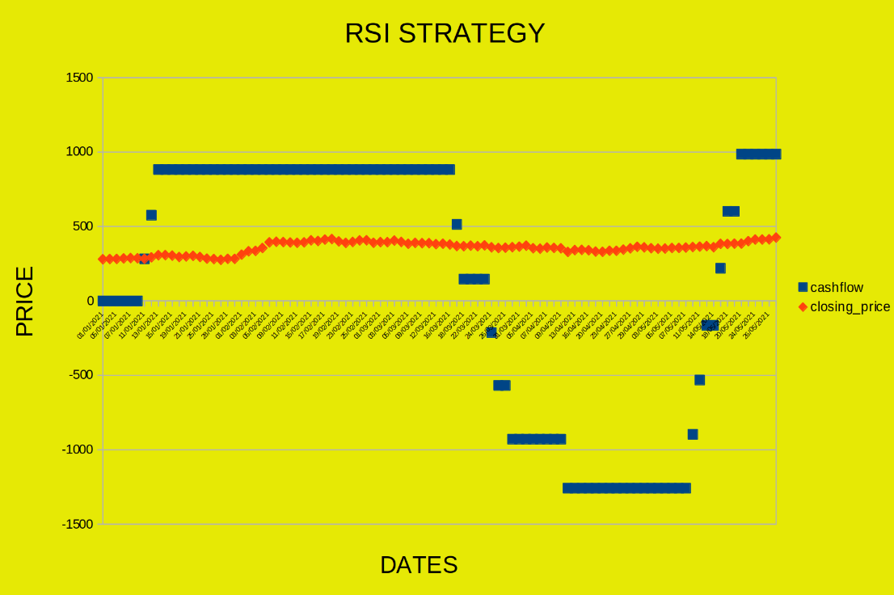

# Trading Strategies in C++

This repository contains implementations of various trading strategies in C++.

## Usage

### Prerequisites

Before running the program, ensure you have the following installed:

- C++ compiler
- Python 3 (for data processing scripts)

### Getting Started

1. Clone the repository:

    ```bash
     git clone https://github.com/your_username/trading-strategies.git

2. Navigate to the project directory:
    ```bash
     cd trading-strategies

3. Compile the source code::
    ```bash
     g++ -o trading_strategy main.cpp -lpthread


2. Navigate to the project directory:
    ```bash
     g++ -o trading_strategy main.cpp -lpthread

4. Compile the source code
    ```bash
     g++ -o trading_strategy main.cpp -lpthread

### Running The Program

To execute a specific trading strategy, run the compiled program with appropriate command-line arguments:

  ```bash
     ./trading_strategy <strategy> <symbol> [additional parameters]
   ```


### ADX
  ```bash
      ./trading_strategy ADX <symbol> <n> <x> <adx_threshold> <start_date> <end_date>
  ```

### BASIC
  ```bash
./trading_strategy BASIC <symbol> <n> <x> <start_date> <end_date>
  ```

### DMA
  ```bash
  ./trading_strategy DMA <symbol> <n> <x> <p> <start_date> <end_date>
  ```

### DMA++
  ```bash
  ./trading_strategy DMA++ <symbol> <n> <x> <p> <max_hold_days> <c1> <c2> <start_date> <end_date>
  ```

### LinearRegression
  ```bash
  ./trading_strategy LinearRegression <symbol> <x> <p> <train_start_date> <train_end_date> <start_date> <end_date>
  ```
### MACD
  ```bash
  ./trading_strategy MACD <symbol> <x> <start_date> <end_date>
  ```

### RSI
  ```bash
  ./trading_strategy RSI <symbol> <n> <x> <oversold_threshold> <overbought_threshold> <start_date> <end_date>
  ```

### PAIRS
  ```bash
  ./trading_strategy PAIRS <symbol1> <symbol2> <n> <x> <start_date> <end_date> <threshold> <stop_loss_threshold>
  ```


**Each strategy generates CSV files containing daily cash flow, order statistics, and a final P&L report.
Below is the discription of all trading startegeies , It contains details about its implementation, insights and results.**


# Trading Strategy: BASIC

### Description
The BASIC trading strategy is a simple algorithmic trading approach implemented in C++. It aims to capitalize on short-term price movements by buying when the price increases consistently over a specified period and selling when the price decreases consistently.

### Parameters
- **Symbol**: The symbol or ticker of the financial instrument being traded.
- **n**: The number of days used to determine price trends.
- **x**: The maximum number of shares to hold.
- **Start Date**: The start date for the trading period.
- **End Date**: The end date for the trading period.

### Implementation
1. **Data Retrieval**: The strategy utilizes Python scripts (`Data.py`) to retrieve historical price data for the specified symbol and time frame.
2. **Data Parsing**: The retrieved data is parsed using C++ functions (`parse_data.cpp`) to extract relevant information such as dates and closing prices.
3. **Trading Logic**:
   - The algorithm analyzes price trends over the specified period (`n` days).
   - It buys shares if the price consistently increases over `n` days and the current holding is below the maximum limit (`x`).
   - It sells shares if the price consistently decreases over `n` days and the current holding is above the negative maximum limit (`-x`).
4. **Output Generation**:
   - Daily cash flow and order statistics are recorded and stored in CSV files (`daily_cashflow.csv`, `order_statistics.csv`).
   - The final profit and loss (P&L) statement is written to `final_pnl.txt`.

### Results and Insights

#### Performance Evaluation
The performance of the BASIC trading strategy can be evaluated by analyzing the generated Profit and Loss (P&L) statement (`final_pnl.txt`). This statement provides insights into the profitability of the strategy over the specified trading period.

#### Visual Analysis
Graphical representations of daily cash flow and order statistics offer valuable insights into the execution and profitability of the BASIC trading strategy. These visualizations can help identify trends, patterns, and potential areas for optimization in the trading strategy.


# Trading Strategy: ADX

### Description
The ADX (Average Directional Index) trading strategy is an algorithmic approach implemented in C++. It aims to identify the strength of a trend in a financial instrument's price movement and make trading decisions based on the calculated ADX value.

### Parameters
- **Symbol**: The symbol or ticker of the financial instrument being traded.
- **n**: The number of days used in the calculation of the ADX and related indicators.
- **x**: The maximum number of shares to hold.
- **ADX Threshold**: The threshold value used to trigger buying or selling signals based on the ADX.
- **Start Date**: The start date for the trading period.
- **End Date**: The end date for the trading period.

### Implementation
1. **Data Retrieval**: Historical price data for the specified symbol and time frame is obtained using Python scripts (`Data.py`).
2. **Data Parsing**: The retrieved data is parsed using C++ functions (`parse_data.cpp`) to extract relevant information such as dates, closing prices, highs, and lows.
3. **Indicator Calculation**:
   - True Range (TR) and Directional Movement (DM) are calculated to determine price volatility and directional movement, respectively.
   - Average True Range (ATR) is computed to smooth out TR over `n` days.
   - Positive Directional Index (DI+) and Negative Directional Index (DI-) are calculated based on DM and ATR.
   - The ADX value is computed using DI+ and DI- to measure the strength of the prevailing trend.
4. **Trading Logic**:
   - The algorithm evaluates the ADX value against the specified threshold.
   - It buys shares if the ADX exceeds the threshold and the current holding is below the maximum limit (`x`).
   - It sells shares if the ADX falls below the threshold and the current holding is above the negative maximum limit (`-x`).
5. **Output Generation**:
   - Daily cash flow and order statistics are recorded and stored in CSV files (`daily_cashflow.csv`, `order_statistics.csv`).
   - The final profit and loss (P&L) statement is written to `final_pnl.txt`.

### Results and Insights
- **Performance Evaluation**: Analyze the generated P&L statement (`final_pnl.txt`) to assess the strategy's profitability and overall performance.
- **Visual Analysis**: Graphical representations of daily cash flow and order statistics can provide visual insights into the strategy's execution and profitability.


# Trading Strategy: DMA

### Description
The DMA (Daily Moving Average) trading strategy is an algorithmic approach implemented in C++. It aims to capitalize on short-term price movements by identifying deviations from the moving average.

### Parameters
- **Symbol**: The symbol or ticker of the financial instrument being traded.
- **n**: The number of days used to calculate the moving average.
- **x**: The maximum number of shares to hold.
- **p**: The threshold multiplier used to trigger buying or selling signals based on deviations from the moving average.
- **Start Date**: The start date for the trading period.
- **End Date**: The end date for the trading period.

### Implementation
1. **Data Retrieval**: Historical price data for the specified symbol and time frame is obtained using Python scripts (`Data.py`).
2. **Data Parsing**: The retrieved data is parsed using C++ functions (`parse_data.cpp`) to extract relevant information such as dates and closing prices.
3. **Moving Average Calculation**:
   - The DMA is calculated by averaging the closing prices over the specified `n` days.
4. **Standard Deviation Calculation**:
   - The standard deviation (SD) is computed to measure the volatility of the closing prices around the DMA.
5. **Trading Logic**:
   - The algorithm compares the current closing price with the DMA and triggers buying or selling signals based on deviations exceeding a threshold (`p * SD`).
   - It buys shares if the current closing price is above the DMA by more than `p * SD` and the current holding is below the maximum limit (`x`).
   - It sells shares if the current closing price is below the DMA by more than `p * SD` and the current holding is above the negative maximum limit (`-x`).
6. **Output Generation**:
   - Daily cash flow and order statistics are recorded and stored in CSV files (`daily_cashflow.csv`, `order_statistics.csv`).
   - The final profit and loss (P&L) statement is written to `final_pnl.txt`.

### Results and Insights
- **Performance Evaluation**: Analyze the generated P&L statement (`final_pnl.txt`) to assess the strategy's profitability and overall performance.
- **Visual Analysis**: Graphical representations of daily cash flow and order statistics can provide visual insights into the strategy's execution and profitability.


# Trading Strategy: DMA++

### Description
The DMA++ (Dynamic Moving Average Plus Plus) trading strategy is an advanced algorithmic approach implemented in C++. It aims to capture trends in a financial instrument's price movement by dynamically adjusting a moving average based on price volatility.

### Parameters
- **Symbol**: The symbol or ticker of the financial instrument being traded.
- **n**: The number of days used to calculate the dynamic moving average.
- **x**: The maximum number of shares to hold.
- **p**: The percentage threshold for buying or selling based on deviation from the moving average.
- **max_hold_days**: The maximum number of days to hold a position before selling.
- **c1** and **c2**: Parameters for adjusting the dynamic moving average based on price volatility.
- **Start Date**: The start date for the trading period.
- **End Date**: The end date for the trading period.

### Implementation
1. **Data Retrieval**: Historical price data for the specified symbol and time frame is obtained using Python scripts (`Data.py`).
2. **Data Parsing**: The retrieved data is parsed using C++ functions (`parse_data.cpp`) to extract relevant information such as dates and closing prices.
3. **Price Volatility Analysis**:
   - Price changes and absolute price changes are computed to calculate the Efficiency Ratio (ER).
   - ER is used to adjust the smoothing factor (SF) dynamically, considering market volatility.
4. **Dynamic Moving Average Calculation**:
   - The dynamic moving average (DMA) is calculated using the adjusted SF.
   - DMA adjusts to changes in price volatility, providing a more responsive indicator of trends.
5. **Trading Logic**:
   - Buy signals are generated when the current price deviates positively from the DMA by a specified percentage (`p`) and the holding is below the maximum limit (`x`).
   - Sell signals are generated when the current price deviates negatively from the DMA by a specified percentage (`p`) and the holding is above the negative maximum limit (`-x`).
   - Positions are held for a maximum number of days (`max_hold_days`) before selling.
6. **Output Generation**:
   - Daily cash flow and order statistics are recorded and stored in CSV files (`daily_cashflow.csv`, `order_statictics.csv`).

### Results and Insights
- **Performance Evaluation**: The strategy's profitability and execution efficiency can be evaluated through the generated P&L statement and order statistics.
- **Volatility Adjustment**: DMA++ dynamically adjusts its moving average based on price volatility, potentially leading to improved trend detection.
- **Parameter Sensitivity Analysis**: Sensitivity analysis can be conducted to understand how adjusting parameters (`c1`, `c2`, `p`, `max_hold_days`) affects strategy performance.
- **Comparison with Static Moving Averages**: Comparing DMA++ with traditional moving average strategies under various market conditions can provide insights into its effectiveness.
- **Risk Management**: Effective risk management techniques, such as position sizing and stop-loss orders, are essential for managing downside risk and enhancing overall strategy performance.


# Trading Strategy: MACD

### Description
The MACD (Moving Average Convergence Divergence) trading strategy is an algorithmic approach implemented in C++. It aims to identify trends in a financial instrument's price movement by analyzing the relationship between two moving averages.

### Parameters
- **Symbol**: The symbol or ticker of the financial instrument being traded.
- **x**: The maximum number of shares to hold.
- **Start Date**: The start date for the trading period.
- **End Date**: The end date for the trading period.

### Implementation
1. **Data Retrieval**: Historical price data for the specified symbol and time frame is obtained using Python scripts (`Data.py`).
2. **Data Parsing**: The retrieved data is parsed using C++ functions (`parse_data.cpp`) to extract relevant information such as dates and closing prices.
3. **Moving Average Calculation**:
   - Two exponential moving averages (EWMtL and EWMtS) are computed based on the closing prices.
   - EWMtL represents the long-term moving average (27-day EMA), while EWMtS represents the short-term moving average (13-day EMA).
   - The MACD line is calculated as the difference between EWMtS and EWMtL.
   - A signal line is generated as a 10-day EMA of the MACD line.
4. **Trading Logic**:
   - Buy signals are generated when the MACD line crosses above the signal line, indicating a bullish trend.
   - Sell signals are generated when the MACD line crosses below the signal line, indicating a bearish trend.
   - The algorithm buys shares if the MACD line is above the signal line and the current holding is below the maximum limit (`x`).
   - It sells shares if the MACD line is below the signal line and the current holding is above the negative maximum limit (`-x`).
5. **Output Generation**:
   - Daily cash flow and order statistics are recorded and stored in CSV files (`daily_cashflow.csv`, `order_statistics.csv`).
   - The final profit and loss (P&L) statement is written to `final_pnl.txt`.

### Results and Insights
- **Performance Evaluation**: Analyze the generated P&L statement (`final_pnl.txt`) to assess the strategy's profitability and overall performance.
- **Visual Analysis**: Graphical representations of daily cash flow and order statistics can provide visual insights into the strategy's execution and profitability.


# Trading Strategy: RSI (Relative Strength Index)

### Description
The RSI (Relative Strength Index) trading strategy is a momentum oscillator that measures the speed and change of price movements. It identifies overbought and oversold conditions in a financial instrument, helping traders make informed buy or sell decisions.

### Parameters
- **Symbol**: The symbol or ticker of the financial instrument being traded.
- **n**: The number of days used to calculate the RSI.
- **x**: The maximum number of shares to hold.
- **oversold_threshold**: The RSI threshold indicating an oversold condition.
- **overbought_threshold**: The RSI threshold indicating an overbought condition.
- **Start Date**: The start date for the trading period.
- **End Date**: The end date for the trading period.

### Implementation
1. **Data Retrieval**: Historical price data for the specified symbol and time frame is obtained using Python scripts (`Data.py`).
2. **Data Parsing**: The retrieved data is parsed using C++ functions (`parse_data.cpp`) to extract relevant information such as dates and closing prices.
3. **RSI Calculation**:
   - RSI is calculated based on the average gain and average loss over the specified period (`n` days).
   - The formula for RSI is: RSI = 100 - (100 / (1 + RS)), where RS (Relative Strength) is the average gain divided by the average loss.
4. **Trading Logic**:
   - Buy signals are generated when the RSI falls below the oversold threshold and the holding is below the maximum limit (`x`).
   - Sell signals are generated when the RSI rises above the overbought threshold and the holding is above the negative maximum limit (`-x`).
5. **Output Generation**:
   - Daily cash flow and order statistics are recorded and stored in CSV files (`daily_cashflow.csv`, `order_statistics.csv`).
   - The final profit and loss (P&L) statement is written to `final_pnl.txt`.

### Results and Insights
- **RSI Thresholds**: Adjusting the oversold and overbought thresholds can impact the frequency of trading signals and overall strategy performance.
- **Confirmation Signals**: RSI signals are often used in conjunction with other technical indicators to confirm buy or sell decisions.
- **Market Conditions**: The strategy's effectiveness may vary depending on market conditions, with different thresholds performing better in different environments.
- **Risk Management**: Implementing risk management techniques, such as position sizing and stop-loss orders, is crucial for managing downside risk and maximizing profitability.





# Trading Strategy: Linear Regression

### Description
The Linear Regression trading strategy employs machine learning techniques to predict price movements based on historical data. It utilizes a linear regression model to analyze past price trends and make predictions about future price changes.

### Parameters
- **Symbol**: The symbol or ticker of the financial instrument being traded.
- **x**: The maximum number of shares to hold.
- **p**: The percentage threshold for triggering buy or sell signals based on price prediction deviations.
- **Train Start Date**: The start date for training data.
- **Train End Date**: The end date for training data.
- **Start Date**: The start date for the trading period.
- **End Date**: The end date for the trading period.

### Implementation
1. **Data Preprocessing**:
   - The historical price data is divided into two sets: one for training the linear regression model and the other for testing the model's predictions.
   - Additional features, such as rolling mean and exponential weighted mean, are calculated to enhance the predictive capability of the model.
2. **Training Phase**:
   - The linear regression model is trained using the training dataset, consisting of features extracted from historical price data.
3. **Prediction**:
   - The trained model is used to predict future price movements based on the features extracted from the testing dataset.
4. **Trading Logic**:
   - Buy or sell signals are generated based on the deviation of predicted prices from actual prices, with the threshold controlled by the parameter `p`.
   - The maximum number of shares to hold is limited by the parameter `x`.
5. **Performance Evaluation**:
   - The strategy's performance is evaluated based on the profit and loss (P&L) generated during the trading period.
6. **Output Generation**:
   - Daily cash flow and order statistics are recorded and stored in CSV files (`daily_cashflow.csv`, `order_statistics.csv`).
   - The final profit and loss (P&L) statement is written to `final_PnL.csv`.

### Results and Insights
- **Predictive Accuracy**: The accuracy of price predictions heavily influences strategy performance. Fine-tuning model parameters and incorporating additional features can enhance predictive accuracy.
- **Risk Management**: Controlling the maximum number of shares held (`x`) and setting appropriate buy/sell thresholds (`p`) are critical for managing risk and maximizing profitability.
- **Model Complexity**: Experimenting with different machine learning models and feature engineering techniques can improve the robustness of the trading strategy.
- **Market Dynamics**: The effectiveness of the strategy may vary across different market conditions. Continuous monitoring and adaptation are necessary to ensure adaptability to changing market dynamics.


# Multithreading  "Best of All" Strategy Evaluation

### Description
This implementation evaluates the performance of multiple trading strategies concurrently using multithreading. The strategies being evaluated include Basic, MACD, DMA, ADX, and Linear Regression. Each strategy is executed in a separate thread, allowing for parallel computation and efficient resource utilization. After all threads have completed their execution, the strategy with the best profit and loss (PnL) is identified and its order statistics and daily cash flow are stored for further analysis.

### Parameters
- **Symbol**: The symbol or ticker of the financial instrument being traded.
- **Start Date**: The start date for the trading period.
- **End Date**: The end date for the trading period.

### Implementation
1. **Strategy Functions**:
   - Separate functions (`basic`, `macd`, `dma`, `adx`, `Lr`) are defined for each trading strategy. Each function takes the necessary parameters (symbol, start date, end date) and returns a `StrategyResult` object containing order statistics and daily cash flow.
2. **Multithreading**:
   - The `bestOfAll` function creates five threads, each corresponding to one trading strategy. It passes the appropriate strategy function and parameters to each thread.
   - Multithreading allows the strategies to be evaluated concurrently, improving overall performance.
3. **Result Evaluation**:
   - Once all threads complete execution, the function compares the profit and loss (PnL) of each strategy to determine the best-performing strategy.
   - The order statistics and daily cash flow of the best strategy are stored in CSV files for further analysis.
4. **Memory Management**:
   - Memory allocated for `StrategyResult` objects is freed after processing to avoid memory leaks.

### Results and Insights
- **Parallel Processing**: Multithreading enables simultaneous evaluation of multiple trading strategies, reducing computation time and improving efficiency.
- **Best Strategy Selection**: The strategy with the highest profit and lowest loss is identified, providing insights into which approach performs best under the given market conditions.
- **Resource Utilization**: By leveraging multithreading, the system optimally utilizes available resources, maximizing throughput and scalability.
- **Error Handling**: Robust error handling mechanisms are necessary to ensure proper synchronization and avoid race conditions during multithreaded execution.


#  Pairs Trading

### Description
This implementation evaluates the Pairs Trading strategy . Pairs Trading involves trading two correlated financial instruments simultaneously based on their relative price movements. The strategy identifies pairs of assets with historically correlated prices and exploits temporary divergences from their historical relationship.

### Parameters
- **Symbol 1**: The symbol or ticker of the first financial instrument.
- **Symbol 2**: The symbol or ticker of the second financial instrument.
- **n**: Parameter for calculating the moving average window size.
- **x**: Maximum number of positions (long or short) that can be held simultaneously.
- **Start Date**: The start date for the trading period.
- **End Date**: The end date for the trading period.
- **Threshold**: Threshold for determining entry or exit points based on the z-score of the price difference.
- **Stop Loss Threshold**: Threshold for implementing a stop-loss strategy to limit losses.

### Implementation
1. **Data Preparation**:
   - Python scripts are used to fetch historical data for both symbols within the specified date range and with the given parameters.
   - The fetched data is parsed and stored in maps for further processing.
2. **Trading Logic**:
   - The Pairs Trading strategy calculates the z-score of the price difference between the two assets and compares it against a predefined threshold to decide whether to enter, exit, or hold a position.
   - If the z-score exceeds the threshold and the maximum position limit allows, a long position is taken in the first symbol and a short position in the second symbol.
   - If the z-score falls below the negative of the threshold and the maximum position limit allows, a short position is taken in the first symbol and a long position in the second symbol.
3. **Stop Loss Management**:
   - If a stop-loss threshold is provided, the strategy monitors the z-score daily and exits positions if the z-score exceeds the stop-loss threshold, potentially limiting losses.
4. **Multithreading**:
   - The `PAIRS` function can operate in two modes: with or without a stop-loss threshold. Both modes utilize multithreading to enhance performance.
   - Multiple instances of the Pairs Trading strategy can be evaluated concurrently for different pairs of assets.
5. **Result Generation**:
   - The strategy generates daily cash flow and order statistics, which are stored in CSV files for further analysis.
   - The final profit and loss (PnL) are calculated and written to a text file.

### Results and Insights
- **Dynamic Pair Selection**: The strategy dynamically identifies pairs of assets with historically correlated prices and trades them based on current market conditions.
- **Risk Management**: Stop-loss functionality helps mitigate potential losses by automatically exiting positions when adverse price movements occur.
- **Performance Evaluation**: Daily cash flow and order statistics provide insights into the strategy's performance over the evaluation period.
- **Scalability**: Multithreading enables the concurrent evaluation of multiple pairs of assets, enhancing scalability and computational efficiency.
- **Parameter Sensitivity**: The strategy's performance may vary based on the choice of parameters such as the moving average window size and threshold values. Sensitivity analysis can help optimize parameter selection.


